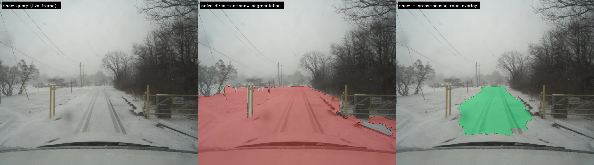
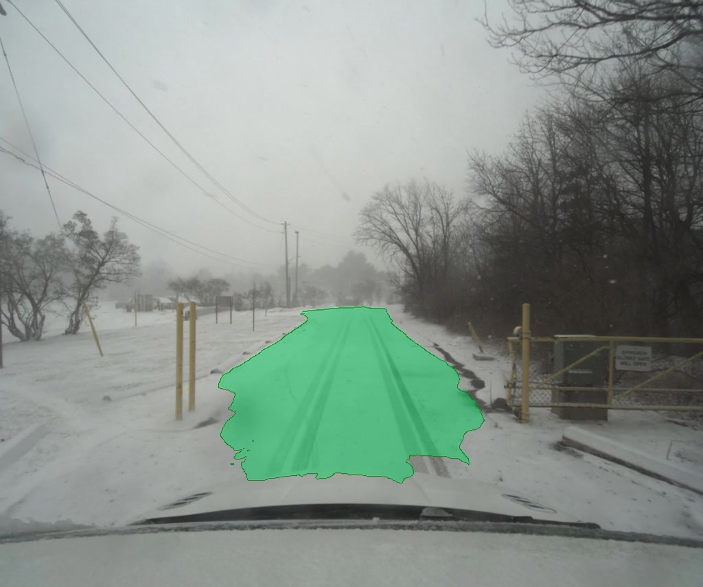

<!-- _class: title -->
<!-- _paginate: false -->

# Snowseer

## Constants as the bridge

###### Minimal-shot autonomy  ·  SoTA Commission I  ·  May 2026

---

## Minimal-shot autonomy

Minimal-shot autonomy concerns how a system survives in
**unfamiliar environments.**

The commonly accepted response is to collect more data and retrain.

We know it works, but it&rsquo;s impractical.

It does not scale across the long tail of conditions a deployed
vehicle, robot, or drone may encounter in the real world: snow,
dust, smoke, washouts, and variable human infrastructure are
obvious examples.

###### A perception system that depends on having been trained on each new condition will lag every condition it has not yet encountered.

---

<!-- _class: image-right -->



## A snow plough's job is simple

**Sweep the road clear.**

The catch: while the plough is doing it,
the road is necessarily invisible.

A self-driving stack trained on traditional road
conditions, applied directly to the plough&rsquo;s camera,
will report with calibrated confidence that the entire
scene is road and should be cleared.

Annotating a labelled snow corpus dense enough to
cover the long tail of road, weather and time-of-day
combinations is uneconomic and chronically incomplete.

---

## A second move

For almost every operating environment where autonomy fails
for lack of data, an adjacent regime exists, temporally or
seasonally or geographically, where data is plentiful and
rich, and whose key components remain the same across
environments.

The road which needs to be ploughed this winter is the same
road it was in the summer.

Its appearance has changed.
Its position in space and relative to local landmarks has not.

###### Snowseer is one demonstration of leveraging structural constants across regimes to achieve minimal-shot autonomy.

---

<!-- _class: principle -->

# The constants-bridge

We propose a primitive.

A *constants-bridge* is a composition that takes a model trained on regime A,
an inference target in regime B, and a known invariant linking the two,
and uses the invariant to transfer the model into B
**without retraining.**

###### The invariant in this work is geometric. The road sits where it sat last summer. The shape is general: anatomy across imaging conditions, terrain across illumination, scene structure across weather, orbital geometry across polar darkness.

---

## How the system works (per snow frame)

<div class="recipe">

1. &nbsp;Pull the **live snowy frame** from the plough's camera.
2. &nbsp;Pull a **clear-season prior** of the same coordinates.
3. &nbsp;**Match** the two with a frozen feature matcher.
4. &nbsp;Estimate a **homography**, biased to the ground plane.
5. &nbsp;Run a Cityscapes road segmenter on the **clear prior only.**
6. &nbsp;**Warp** the road mask onto the snowy frame.

</div>

The plough now knows where the road is.
No model in the pipeline has been trained on snow.

---

## Architecture

| Component | Role | Pretrained on |
|-----------|------|---------------|
| **DISK** &nbsp;*(NeurIPS '20)* | Local features | MegaDepth · no snow |
| **LightGlue** &nbsp;*(ICCV '23)* | Sparse matcher | MegaDepth · no snow |
| **USAC-MAGSAC** &nbsp;*(CVPR '20)* | Robust homography | n/a |
| **Mask2Former** &nbsp;*(CVPR '22)* | Road segmenter | Cityscapes · no snow |
| **Boreas** &nbsp;*(IJRR '23)* | Snow + paired summer captures | n/a (CC BY 4.0) |

Every learned component is **frozen.**
Snow appears only at inference, as the runtime input.

---

## The dataflow

```
   Snow frame                Clear-prior frame
        │                            │
        │                            ▼
        │                   Mask2Former (frozen)
        │                            │ road mask in prior space
        │                            │
        └──►  DISK + LightGlue  ◄────┘   (frozen)
                     │
                     ▼ correspondences
            USAC-MAGSAC homography  (ground-plane biased)
                     │
                     ▼ H
            warp prior mask → snow space
                     │
                     ▼
            fuse over K=3 priors  +  EMA over time
                     │
                     ▼
            Road overlay on the snow frame
```

###### The video extension wraps this in three thin layers: a track loader, a prior pool of K=3 nearest summer captures, and an EMA on the binary mask (α = 0.4).

---

<!-- _class: full-bleed -->



---

## What we built

A 14-second video clip from a snow-covered residential street in Toronto
(Boreas `boreas-2021-01-26-11-22`, January 2021). Continuous green road
overlay tracking the buried road frame by frame.

A second 34-second clip on a different Toronto drive in different snowfall
conditions (`boreas_2025_02_15`) runs the same pipeline with the same
parameters. Same code, different snow.

An 18-pair static-stills precursor across northern Sweden and Finland
predates the video extension.

###### Without pixel-level snowy-road ground truth, IoU and coverage percentages would be cherry-picked. The qualitative claim is what we make: the road overlay tracks the buried road continuously, on a pipeline whose learned components have never seen snow.

---

## Known limitations

*The pipeline is not, currently, real-time.* The matching pass dominates per-frame compute, taking around 16 s per frame on Mac CPU. Demo clips build end-to-end in roughly an hour. Real-time operation needs a substantially faster matcher and segmenter. That is a deployment-engineering problem, not a research one, and there is nothing in the principle that stops a knowledge-transfer system running live.

*The system is not, currently, able to be deployed arbitrarily.* The current code is contingent on a specific format of high-quality clear-road imagery and is geared toward producing the demo material. Generalising to any road with Google Street View (or a comparable source) available is feasible (the pipeline is substrate-agnostic in principle), but integrating a wider source corpus is a natural next step.

###### The output answers *where the road is expected to be*, not *where the plough should clear*. A deployed system integrates Snowseer with lidar, depth, and obstacle detection. Each is then unburdened of the road-position problem on a buried road.

---

## Generalising

The shape repeats across the long tail.

| Regime | Invariant | Why labelling fails |
|---|---|---|
| **Polar Earth observation** | orbital geometry: same satellite, same coordinates, known cadence | polar conditions are seasonally extreme and sparsely sampled |
| **Low-light medical imaging** | patient anatomy across imaging conditions | each new scope, sensor, or contrast is its own regime |
| **Agricultural off-road** | field geometry from a previous-season drone overflight | every season, crop and region is a new long-tail entry |

Snow on a road is one instantiation. The constants-bridge transfers.

---

## Where this could go

The constants-bridge primitive is the foundation for
**a general image-banking-and-transfer appliance.**

> Live frame + location signal &rarr; register against a banked clear-conditions image &rarr; transfer any pre-computed annotation into the live frame.

The snowplough&rsquo;s road-position channel is one consumer.
The same recipe powers fog, dust, smoke, heavy rain and night driving;
heads-up display navigation; seeing round corners (V2V or earlier captures of the same drive);
construction-zone delta detection; industrial inspection in obscured environments.

---

## What the prize money funds

1. **Real-time matcher**: GPU-port DISK + LightGlue (or RoMa / LoFTR); bring per-frame matching from around 16 s on Mac CPU to under 1 s on a deployment-class device. Required for live operation.
2. **Visual place recognition front-end**: replace the GPS-pose lookup with a learned recognition step so the appliance works in GPS-denied environments and without prior pose.
3. **Multi-source clear-season image bank**: curate and integrate a wider source corpus (Mapillary global, Street View, operator captures) so any covered road can be a deployment target.
4. **Hardware prototype**: battery-powered processing unit running the live appliance with a simple HUD-esque output, demonstrating snow, fog and night-driving consumers end-to-end.

###### The snowplough's road-position channel is one consumer of this appliance. The same recipe could power fog, dust, smoke, heavy rain and night driving, heads-up display navigation, seeing round corners, and many more obscured-regime use cases.

---

## Reproduce

```
git clone https://github.com/aturner22/snowseer
cd snowseer
uv sync --python 3.12
make reproduce
```

`make track TRACK=<id>`: full pipeline on any registered track.
`make stills`: static-stills precursor (needs `MAPILLARY_TOKEN`).
`make oracle TRACK=<id>`: pre-flight gate before a new cache build.
`make notebook`: re-execute `docs/analysis.ipynb` in place.
`make pdfs`: render `writeup.pdf` + `slides.pdf`.

---

<!-- _class: title -->
<!-- _paginate: false -->

# Constants as the bridge

## A primitive, and an appliance

###### Snowseer · SoTA Commission I · Minimal-Shot Autonomy · May 2026

---

<!-- _class: footer-card -->
<!-- _paginate: false -->

###### Read

`README.md` &nbsp;·&nbsp; `docs/writeup.md` &nbsp;·&nbsp; `docs/analysis.ipynb` &nbsp;·&nbsp; `docs/index.html`

###### Submission

[SoTA Commission I: Minimal-Shot Autonomy](https://sotaletters.substack.com/p/sota-commission-i-minimal-shot-autonomy)
&nbsp;·&nbsp; May 2026 &nbsp;·&nbsp; Boreas dataset CC BY 4.0
