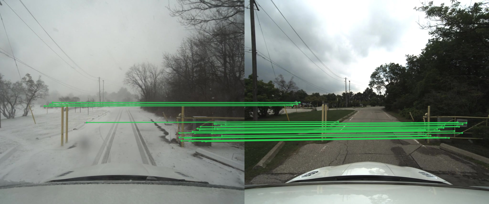
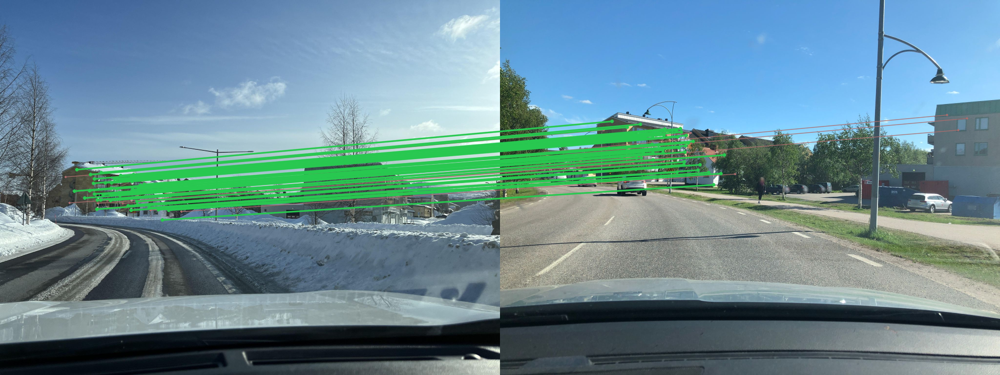
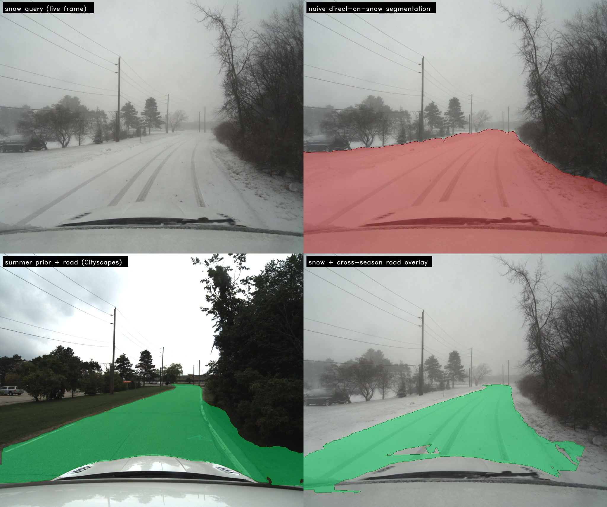
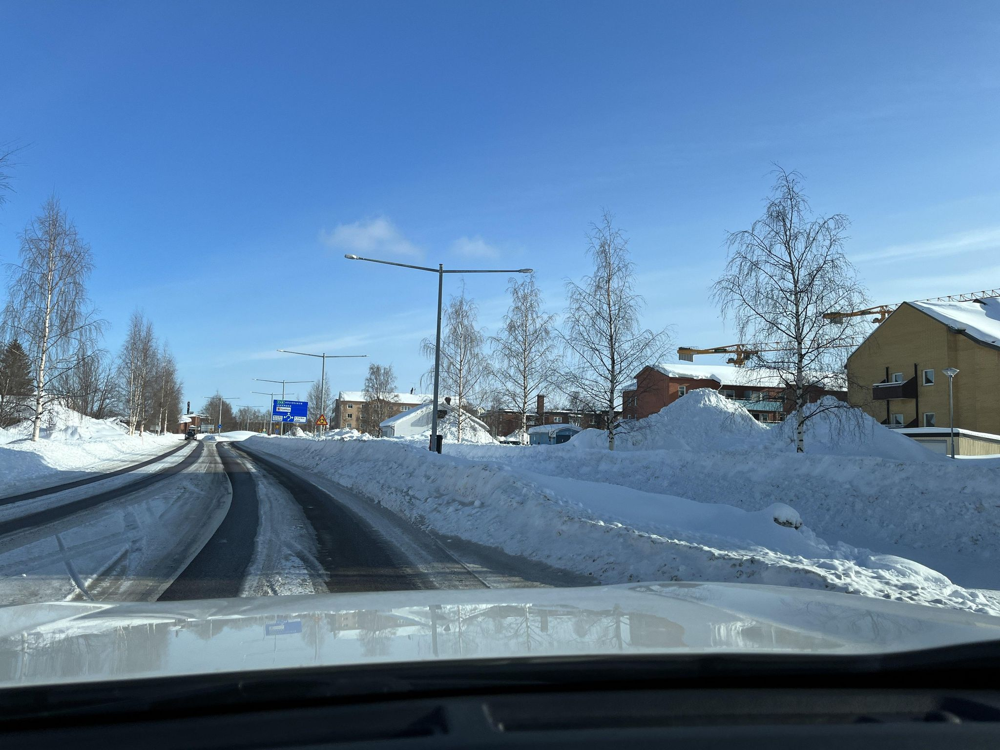
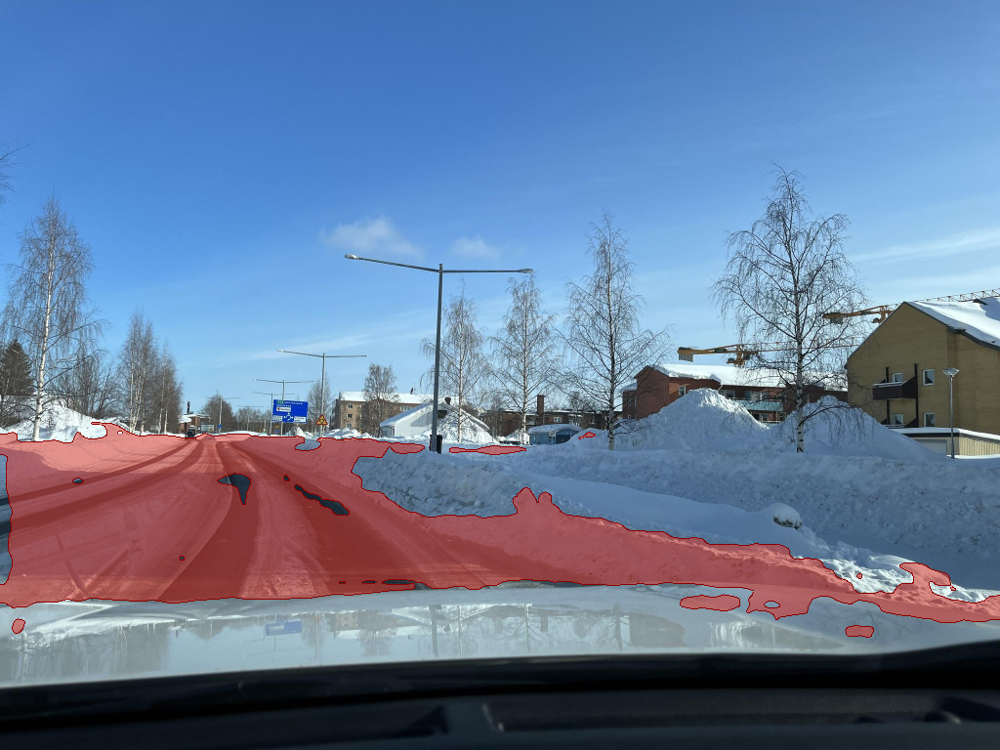
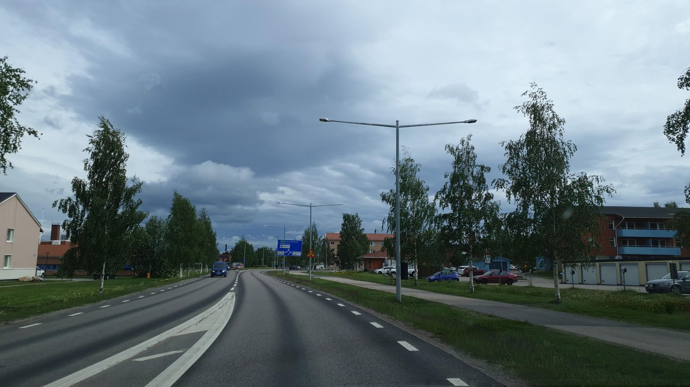
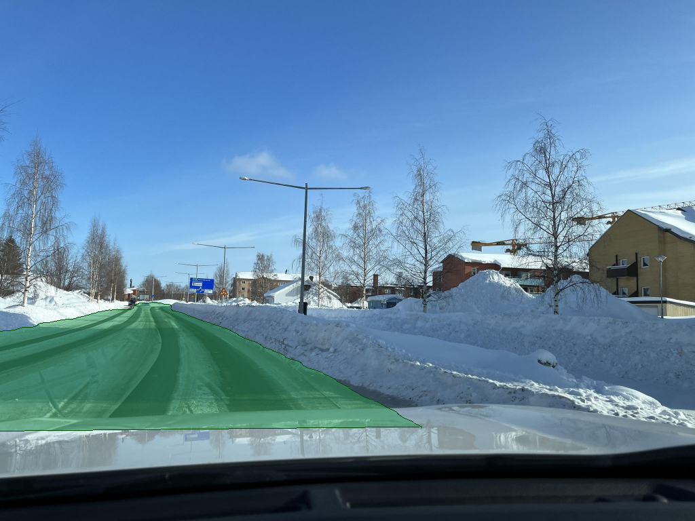

## Minimal-Shot Autonomy

Minimal-shot autonomy concerns the question of how a system survives in unfamiliar environments. The commonly accepted response to this problem is to collect more data and retrain the model. We know this answer works, but it's impractical. It does not scale across the long tail of conditions a deployed vehicle, robot, or drone may encounter when deployed in the real world: snow, dust, smoke, washouts and variable human infrastructure spring to mind as obvious examples of adversarial conditions. A perception system that depends on having been trained on each new condition will not only be expensive and cumbersome to develop, but necessarily lag every condition it has not yet encountered.

The protagonist of this project is the humble snow clearing vehicle. Snow-clearing is ripe for automation - maintaining a workforce of trained drivers for engagement during only a small subset of the year, yet who must deploy at very short notice, is inefficent and expensive... 

A snow plough's job is simple: **sweep the road clear**. The obvious difficulty is, while the plough is in operation, the road is necessarily invisible. Curbs are buried, lane markings are gone, the boundary between asphalt and verge is no longer defined. A self-driving stack trained on traditional road conditions, applied directly to the plough's camera, will report with calibrated confidence that the entire scene is road and should be cleared. 

Attempting to solve this problem via annotation of a labelled snow dataset large enough to cover the long tail of road / weather / time-of-day combinations is uneconomic and will be chronically incomplete. The alternative principle proposed in this project does not require new training data and is applicable across the concept of minimal-shot autonomy. 

For almost every operating environment where autonomy fails due to lack of data, an ajecent regime exists (temporally, seasonally, geographically), where data is plentiful and rich and whose key components remain the same across environments. The road which needs to be ploughed this winter is the same as it was in the summer. It's appearance has changed, but its position in space and relative to local landmarks has not. 

This project, Snowseer, is a canonical demonstration of the principle of leveraging training data via structural constants across environments and how an system can operationally transfer knowledge across regimes to achieve minimal-shot autonomy


## The constants-bridge

The core of this project is a simple idea: a *constants-bridge*. This refers to the scenario of a model trained on regime A, an inference target in regime B, and a known invariant linking A and B, and leveraging the invariant characteristics of each regime to transfer the model into environment B *without retraining*. The invariant in this work is geometric: the road sits where it sat last summer, in the same place relative to other landmarks, but the shape is more general. Anything that stays observable and unchanged between two regimes is a candidate bridge: anatomy across medical imaging environments, terrain across illumination states, scene structure across weather conditions.

The constituent parts are not new. Geometric scene analysis, classical RANSAC, and pretrained feature matchers and segmenters have been combined in many ways across the computer-vision literature. The contribution this submission makes is to identify the composition of the environment itself as a key feature to leverage, and to give an end-to-end working demonstration showing the property the brief calls far — *generalisation through visual understanding, not memorisation*. The feature matcher in our pipeline is not generalising its recongition of "snow": it has not been trained on snow (in fact, snow scenes were explicitly excluded from testing scenarios). The focus is generalisation via what stays the same.



## Snowseer

A pre-trained feature matcher establishes correspondences between the live snow frame and a clear-season prior of the same coordinates. A homography (projection transformation) is fitted to those correspondences and geometrically connects the clear-season prior to the snow frame. A pre-trained segmenter produces a road mask on the *clear* prior and that mask is warped through the homography onto the winter image, producing an overlay of where the road is underneath the snow.



Per snow frame, there are six steps:

1. Pull the live snowy frame from the plough's camera.
2. Pull a clear-season prior of approximately the same coordinates.
3. Examine the two with DISK + LightGlue feature-matching models.
4. Estimate a homography via a USAC-MAGSAC RANSAC model.
5. Run a Mask2Former segmenter model on the *clear* prior only to obtain the true position of the road in clear conditions.
6. Warp the road mask into the snow frame via the homography and overlay to the plough's visuals.

```
   ┌──────────────┐                    ┌──────────────────────┐
   │  Snow frame  │                    │  Clear-prior frame   │  Any geo-tagged
   │   (live)     │                    │                      │  clear-weather
   │              │                    │                      │  imagery 
   └──────┬───────┘                    └──────────┬───────────┘
          │                                       │
          │                                       ▼
          │                            ┌──────────────────────┐
          │                            │ Mask2Former segmenter│  Pretrained
          │                            │                      │  
          │                            └──────────┬───────────┘
          │                                       │ Road mask in prior space
          │                                       │
          └►  DISK + LightGlue feature matching ◄─┘             Pretrained
                              │  
                              │                                
                              ▼ Image correspondences
                    USAC-MAGSAC homography                       
                              │
                              ▼ 
                  warp prior mask → snow space
                              │
                              ▼
                    fuse over K=3 priors  +  EMA over time for smoothness
                              │
                              ▼
                  ┌──────────────────────┐
                  │  Road overlay on the │
                  │      snow frame      │
                  └──────────────────────┘
```



The video processing mode wraps a per-still-image-pair pipeline in three thin layers: a track loader indexing snow and summer streams by GPS pose, a prior pool returning the K = 3 nearest summer captures by distance for each snow frame, an exponential moving average ($\alpha = 0.4$) on the binary road mask to produce a smoother continuous render of the transferred road position. 

It's important to emphasise that the output of the Snowseer pipeline is restricted to presenting **only where the road is expected to be**, not where the snow should necessarily be cleared by the plough. A broader autonomous snow-clearing system would integrate Snowseer with numerous other sensing and safety processes, such as lidar, computer vision models suitable for autonomous and reactive robotic components. 

Components used unmodified and crucially *without any retraining*: DISK (Tyszkiewicz et al., NeurIPS 2020) for keypoint extraction, LightGlue (Lindenberger et al., ICCV 2023) for descriptor matching, USAC-MAGSAC (Barath et al., CVPR 2020) for robust homography, Mask2Former (Cheng et al., CVPR 2022) trained on Cityscapes (Cordts et al., CVPR 2016) for road segmentation. None are fine-tuned on snow.


## What was built, and what was found out trying it

The demo material are video clips from snow-covered rural and suburban streets in Toronto (Boreas January 2021 and February 2025). The pipeline produces a continuous green road-region overlay tracking the buried road frame by frame. A side-by-side naive baseline — the same Cityscapes segmenter applied directly to the snow frame — is included for contrast and to demonstrate the capability of this system: the naive overlay is sprawls across frames into clearly non-road territory. The road overlay tracks the buried road continuously through the examples on a pipeline whose learned components have never seen snow. The same pipeline was also verified to perform well on the same driving scene but during a different season, with different snowfall. As well as this, there are also 18-pair static-stills from different nordic regions, covering distinct snow scenes, road layouts and environments.


{width=48%} {width=48%}

{width=48%} {width=48%}

The entire pipeline is reproducible from a clean clone with `make reproduce`. The only handle the system has on the snow regime is the clear-season prior of the same place.

## Known limitations

*The pipeline is not, currently, real-time.* 

Partly due to lack of access to a snow plough and vast amounts of snow, but perhaps also due to computational constraints, the road overlay pipeline currently runs asynchronously to when images are taken. Obviously, this is a barrier to deployment, but is an implementation task which is certainly surmountable if this project were to take a more operational form. There is nothing from stopping a system that transfers knowledge across regimes from operating in real time. 

The matching pass dominates the per-frame compute burden and can certainly be streamlined. The demo clips build end-to-end in roughly an hour on Mac CPU.Real-time processing would require a substantially faster matcher and segmenter, which would constitute a deployment-engineering problem rather than a research question, and is the first item in the next-steps section.


*The system is not, currently, able to be deployed arbitrarily* 

The design of the present iteration of the pipeline is contingent on a certain format of high-quality clear-road imagery. Whilst it is certainly feasible to generalise the system to operate on any given road with Google Street View (or similar) available, the current code does not support this and is geared toward producing the specific material in this demonstration. Integrating a wider source corpus is a natural next step. 

## Where this could go

It should be emphasised that the key contribution of this project is not to revolutionalise the snow ploughing process, rather to present the concept of 'constants as a bridge' as a foundation general information transfer across environments. Other projects of a similar nature and possessing similar structural characteristics should certainly be explored. 

To get the snowplough-specific project to the operational level, the next steps are to upgrade the following componts: 
- Input: a live camera feed and a location signal (GPS or a learned visual place recognition step). 
- Image bank: a large geo-tagged image database — Mapillary global, Street View, the operator's own captures etc. 
- Processor: register the live frame against nearest bank candidates via an efficient form of geometric matching. 
- Output: any pre-computed annotation from the bank, transferred into live-frame coordinates. 

The snowplough's road-position channel is one consumer of this appliance. The same appliance, with the same recipe, could easily power fog / dust / smoke / heavy-rain / night driving as well as heads-up display navigation, seeing around corners, along with many more use-cases.

Some actionable development ideas the prize money could fund to further this project are:

1. **Real-time matcher** — Utilise the efficiency of a GPU; bring per-frame matching from ~16 s on Mac CPU to <1s on a more appropriate device. This would be required for live operation.
2. **Visual place recognition front-end** — replace the GPS-pose lookup with a learned recongition step so the appliance works in GPS-denied environments and without prior pose.
3. **Multi-source clear-season image bank** - needs to be curated and integrated into the pipeline. 
4. **Hardware prototype** — a battery-powered processing unit running the live appliance with a simple HUD-esque output, able to demonstrate the snow / fog / night-driving consumer scenarios end-to-end.


---

*Code, video clips, and the static-stills precursor: see the [project repository](../README.md). Reproducible from a clean clone via `make reproduce`. Companion notebook at `analysis.ipynb` walks through the principle, the worked example.

Acknowledgements and citations: Boreas dataset (Burnett et al., IJRR 2023, UTIAS-ASRL) under [CC BY 4.0](https://creativecommons.org/licenses/by/4.0/). Mapillary imagery under the Mapillary open-data licence. Models pretrained by their respective authors and used frozen. 

Submitted to [SoTA Commission I — Minimal-Shot Autonomy](https://sotaletters.substack.com/p/sota-commission-i-minimal-shot-autonomy), May 2026.*
